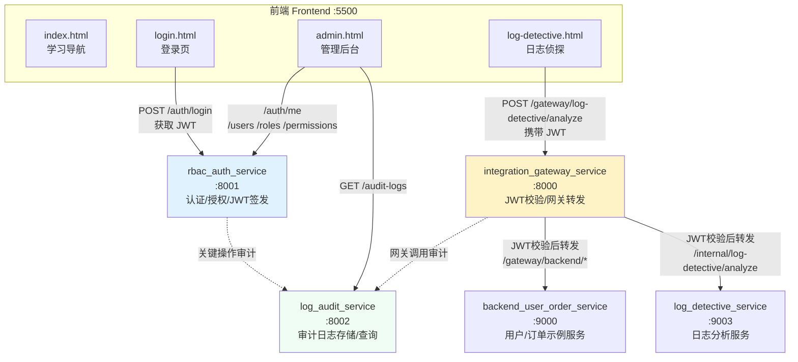

# 系统架构说明

本文档详细说明 Python 学习仓库中微服务系统的架构设计、服务职责和调用关系。

## 架构总览

本系统包含 **5 个微服务** 和 **1 个前端静态页面集合**，演示完整的认证、网关、审计和业务服务调用链路。

### 架构图



**图例说明**：
- 实线箭头：HTTP 请求调用
- 虚线箭头：异步审计日志上报
- 蓝色：认证服务
- 黄色：网关服务
- 绿色：审计服务

## 服务详细说明

### 1. rbac_auth_service (端口 8001)

**职责**：
- 用户认证（登录/登出）
- JWT Token 签发与验证
- 用户/角色/权限管理（RBAC 模型）
- 关键操作审计日志上报

**技术栈**：FastAPI + SQLAlchemy + JWT + Redis（可选）

**主要接口**：
| 路径 | 方法 | 说明 |
|------|------|------|
| `/auth/login` | POST | 用户登录，返回 JWT Token |
| `/auth/logout` | POST | 用户登出 |
| `/auth/me` | GET | 获取当前用户信息 |
| `/users` | GET/POST/PATCH | 用户管理 |
| `/rbac/roles` | GET/POST/PATCH | 角色管理 |
| `/rbac/permissions` | GET/POST | 权限管理 |

**教学重点**：
- RBAC 权限模型实现
- JWT 认证流程
- 依赖注入模式（`require_roles`、`require_permissions`）

### 2. log_audit_service (端口 8002)

**职责**：
- 接收和存储操作审计日志
- 提供日志查询接口
- 支持按用户/服务/时间范围过滤

**技术栈**：FastAPI + SQLAlchemy

**主要接口**：
| 路径 | 方法 | 说明 |
|------|------|------|
| `/logs` | POST | 写入审计日志 |
| `/logs` | GET | 查询审计日志（支持过滤） |

**教学重点**：
- 审计日志的设计模式
- 异步日志上报（失败静默处理）
- 日志查询与过滤

### 3. integration_gateway_service (端口 8000)

**职责**：
- API 网关统一入口
- JWT Token 验证
- 请求转发到下游服务
- 统一响应格式包装
- 审计日志上报

**技术栈**：FastAPI + httpx（异步 HTTP 客户端）

**主要接口**：
| 路径 | 方法 | 说明 |
|------|------|------|
| `/gateway/backend/users/{id}` | GET | 代理查询用户 |
| `/gateway/backend/orders` | POST | 代理创建订单 |
| `/gateway/log-detective/analyze` | POST | 转发日志分析请求 |

**教学重点**：
- 网关转发模式
- JWT 验证与用户信息传递
- 统一错误处理（502/504）
- 客户端封装模式

### 4. backend_user_order_service (端口 9000)

**职责**：
- 提供用户查询接口
- 提供订单创建接口
- 作为"下游业务服务"的示例

**技术栈**：FastAPI（极简实现，内存存储）

**主要接口**：
| 路径 | 方法 | 说明 |
|------|------|------|
| `/api/users/{id}` | GET | 查询用户信息 |
| `/api/orders` | POST | 创建订单 |

**教学重点**：
- 简单 REST API 设计
- 作为网关下游服务的示例

### 5. log_detective_service (端口 9003)

**职责**：
- 日志文本分析（正则表达式）
- 提取可疑 IP
- 统计错误/警告数量
- 识别关键错误记录
- 演示安全编程实践（输入限制、ReDoS 防护）

**技术栈**：FastAPI + 正则表达式

**主要接口**：
| 路径 | 方法 | 说明 |
|------|------|------|
| `/internal/log-detective/analyze` | POST | 分析日志文本 |
| `/health` | GET | 健康检查 |

**教学重点**：
- 正则表达式实战应用
- 安全编程（输入大小限制、超时保护）
- 内存处理模式（不持久化原始日志）

## 前端页面说明

### index.html - 学习导航主页
- 章节导航
- 在线 Python 执行器（Pyodide）
- 项目实战入口

### login.html - 登录页面
- OAuth2 密码模式认证
- 直接调用 `rbac_auth_service`
- Token 存储于 localStorage

### admin.html - 管理后台
- 用户/角色/权限管理
- 审计日志查看
- 直接调用 `rbac_auth_service` 和 `log_audit_service`

### log-detective.html - 日志侦探工具
- 日志文本输入
- 通过 `integration_gateway_service` 转发到 `log_detective_service`
- 演示网关转发模式

## 关键调用流程

### 流程 1：用户登录

```
1. 用户在 login.html 输入用户名/密码
2. POST /auth/login → rbac_auth_service
3. rbac_auth_service 验证凭据，签发 JWT Token
4. 前端存储 Token 到 localStorage
5. rbac_auth_service 上报审计日志到 log_audit_service
```

### 流程 2：管理后台操作

```
1. admin.html 从 localStorage 读取 Token
2. 携带 Token 调用 rbac_auth_service 的管理接口
3. rbac_auth_service 验证 Token 和权限
4. 返回数据或执行操作
5. 关键操作上报审计日志到 log_audit_service
```

### 流程 3：日志分析（网关转发模式）

```
1. log-detective.html 提交日志文本
2. POST /gateway/log-detective/analyze → integration_gateway_service
3. gateway 验证 JWT Token
4. gateway 转发到 log_detective_service 的 /internal/log-detective/analyze
5. log_detective_service 分析日志并返回结果
6. gateway 包装响应返回前端
7. gateway 上报审计日志到 log_audit_service
```

### 流程 4：网关代理业务服务

```
1. 前端携带 JWT 调用 gateway 的 /gateway/backend/* 接口
2. gateway 验证 JWT，提取用户信息
3. gateway 根据用户角色判断权限
4. gateway 转发请求到 backend_user_order_service
5. 返回结果并上报审计日志
```

## 教学要点总结

### 1. 认证与授权
- **JWT 认证流程**：login → RBAC 签发 Token → 前端携带 Token 调用
- **RBAC 权限模型**：用户-角色-权限三层关系
- **依赖注入**：`require_roles`、`require_permissions` 装饰器

### 2. 网关模式
- **统一入口**：所有外部请求通过网关
- **JWT 验证**：网关统一验证 Token
- **请求转发**：网关代理下游服务
- **统一响应**：`ApiResponse` 包装

### 3. 审计日志
- **异步上报**：业务操作后异步发送日志
- **失败静默**：日志上报失败不影响业务
- **统一格式**：actor/action/resource/detail

### 4. 服务间通信
- **HTTP 客户端封装**：`BackendServiceClient`、`LogDetectiveClient`
- **统一错误处理**：超时、连接失败、HTTP 错误
- **依赖注入**：通过 FastAPI Depends 注入客户端

### 5. 安全实践
- **输入验证**：Pydantic 模型验证
- **大小限制**：日志文本大小/行数限制
- **XSS 防护**：前端使用 `textContent` 而非 `innerHTML`
- **ReDoS 防护**：正则表达式超时保护（教学示例）

## 部署与运行

详见根目录 `README.md` 的"微服务联调快速启动"章节。

## 相关文档

- 各服务详细说明：见各服务目录下的 `09_项目说明.md`
- 联调指南：`网关_RBAC_后端联调说明.md`
- 前端说明：`frontend/README.md`
